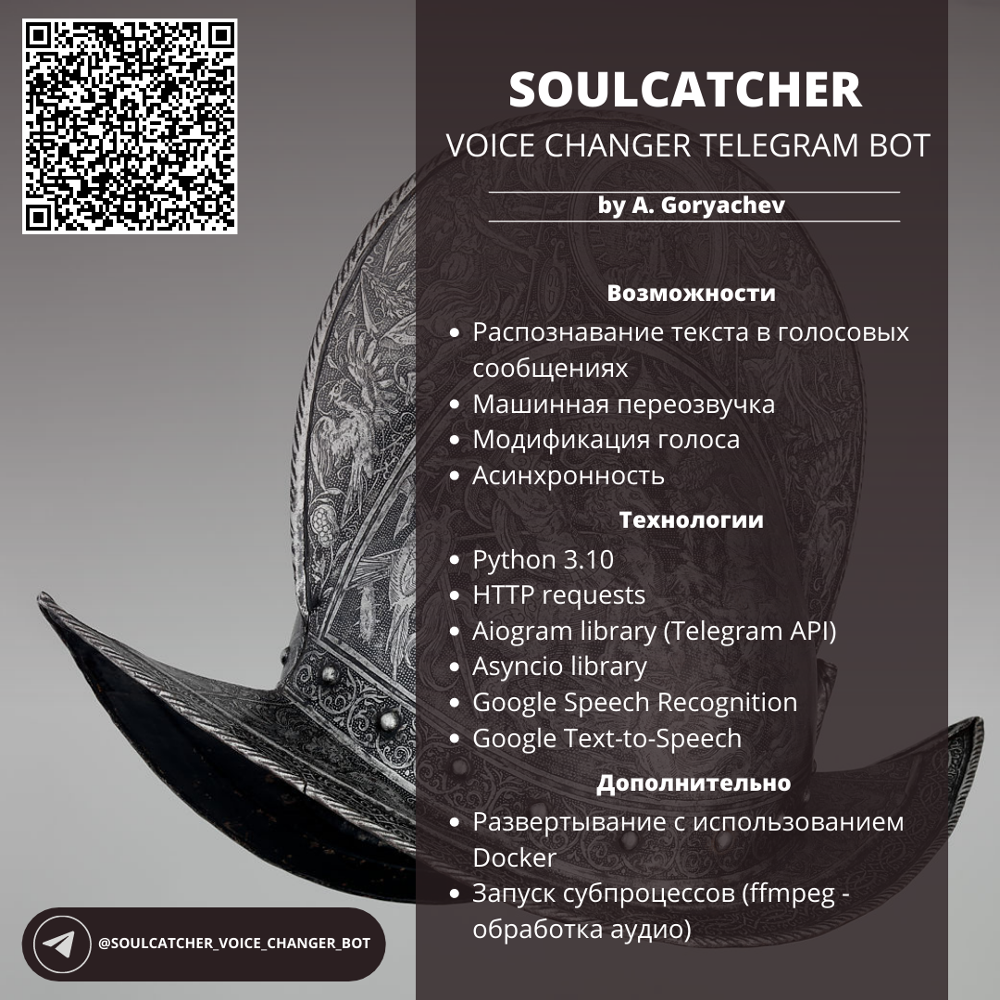

<h1>Описание</h1>

<a href="https://t.me/Soulcatcher_voice_changer_bot">Soulcatcher voice changer bot</a>, представляет собой интерактивного телеграм бота, предназначенного для обработки и модификации голосовых сообщений, с целью обеспечения анонимности пользователя.

Бот может работать как автономно - обрабатывая запросы, поступающие ему в личные сообщения, так и производить обработку голосовых сообщений, будучи приглашенным в публичную группу. Причем во втором случае, имеется возможность задать индивидуальные настройки взаимодействия с ботом, для каждого участника группы.

Для получения результата, необходимо сделать всего две вещи: Выбрать режим работы бота и отправить ему голосовое сообщение. Бот способен обрабатывать как свежезаписанные голосовые сообщения, так и пересланные из каких-либо источников. Язык интерфейса бота автоматически подстраивается под локаль пользователя.

Существует четыре режима работы: 
<ul>
 <li><b>Распознавание речи</b> - команда /recognite. Бот распознает речь во входящем голосовом сообщении и отправит его текстовую расшифровку.</li>
 <li><b>Машинная переозвучка</b> - команда /resound. Бот распознает речь во входящем сообщении и отправит ответное голосовое сообщение, переозвучив этот текст при помощи Google Text-to-speech.</li>
 <li><b>Изменение тональности</b> - команда /pitch. Бот примет голосовое сообщение, изменит его тональность на случайную величину и вернет результат в ответном голосовом сообщении.</li>
  <li><b>Перевод текста</b> - команда /translate. Отдельная функция для перевода текстовых сообщений. Все остальные режимы мультиязычны и могут исользоваться с несколькими языками.</li>
</ul>

Всю информацию, касательно режимов и особенностей использования бота, можно получить командой /help.

<h1>Используемые технологии</h1>

Бот написан на Python 3.10, помимо стандартных библиотек, бэкэнд бота имеет ряд зависимостей, первая и самая важная из них - фреймворк <a href="https://pypi.org/project/aiogram/">aiogram</a>. Aiogram, предназначен для асинхронного взаимодействия с Telegram API. Все взаимодействие с Telegram API, за исключением скачивания и отправки файлов на сервера Telegram, реализованы методами данного фреймворка, во взаимодействии с стандартной (в текущей версии Python) библиотекой Asyncio. Взаимодействие с файлами использует стандартную библиотеку Requests.

Распознавание речи реализовано через библиотеку <a href="https://pypi.org/project/SpeechRecognition/">SpeechRecognition</a>. С помощью методов даннной библиотеки, происходит применение технологии Google Speech-to-Text.

Модуляция речи производится с помощью библиотеки <a href="https://pypi.org/project/gTTS/">gTTS</a>

Для изменения тональности голосовых сообщений, применяется пакет <a href="https://ffmpeg.org/ffmpeg">FFmpeg</a>. Обращение к данному пакету, происходит путем вызова паралельного процесса на сервере, с помощью нативной библиотеки Subprocess

Перевод текста осуществляется через библиотеку <a href="https://pypi.org/project/translators/">Translators</a>, с помощью API Google Translate.

Менеджмент зависимостей обеспечивается посредством пакета poetry.

<h1>Развертывание</h1>

Soulcatcher разрабатывался с учетом последующего развертывания с применением технологии контейнеризации, посредством Docker. Развертывание контейнера проекта полностью автоматизировано и не потребует дополнительных действий. Тем не менее, инструкция по развертыванию проекта без использования Docker, так-же будет приведена.

<b>Развертывание с помощью Docker:</b>

<ul>
 <li>Клонируйте репозиторий.</li>
 <li>Добавьте Telegram token вашего бота в модуль env.py, находящийся в корневой директории.</li>
 <li>Создайте Docker образ, при помощи команды &ltdocker build -t soulcatcher:bot .&gt.</li>
 <li>Запустите Docker образ.</li>
</ul>

<b>Развертывание без использования Docker:</b>

<ul>
 <li>Клонируйте репозиторий.</li>
 <li>Добавьте Telegram token вашего бота в модуль env.py, находящийся в корневой директории.</li>
 <li>Создайте в корневой директории, директорию temp.</li>
 <li>Создайте в директории temp, две директории: voice и machine. Данные директории используются для временного хранения звуковых файлов в процессе обработки.</li>
 <li>Установите пакет poetry.</li>
 <li>Установите зависимости командой &ltpoetry install&gt.</li>
 <li>Установите пакет ffmpeg.</li>
 <li>Запустите сервер бота, командой &ltpoetry run python3 main.py&gt.</li>
</ul>

Бэкэнд бота тестировался под относительно высокими нагрузками на ввод-вывод, не смотря на то, что автоматической перезагрузки контейнера не предусмотрено, эту опцию, при желании, можно добавить в Dockerfile самостоятельно. Тем не менее случайных вылетов не зафиксировано.

<i>P.S. Секрет выбора аватарки, названия и функционала бота, заключается в одноименном персонаже с соответствующими способностями, из замечательной серии романов Г. Кука, "Черный отряд".</i>
